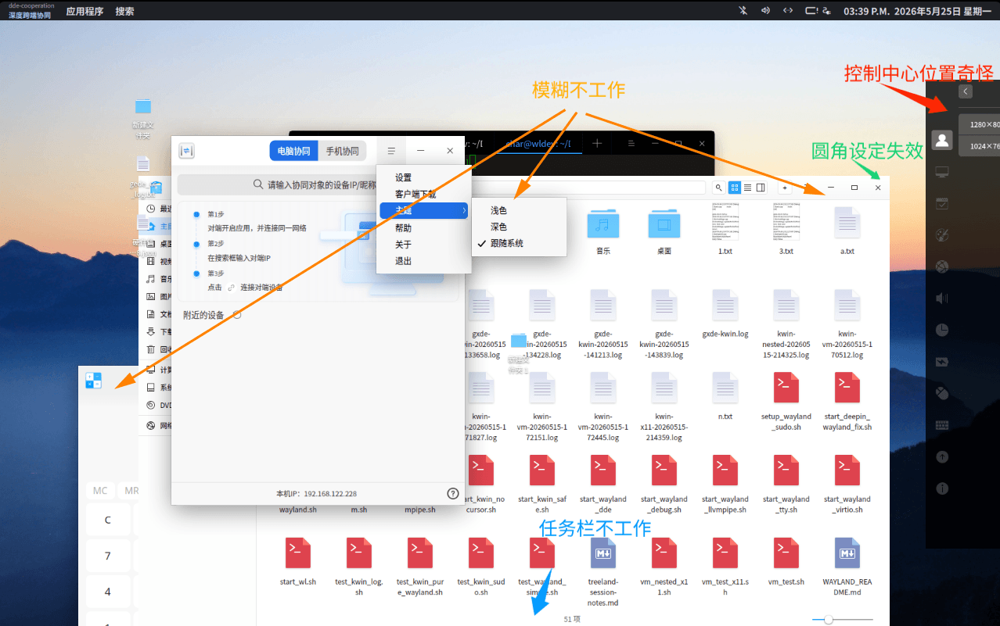

# 使用Treeland作为Wayland WM并引导桌面启动
## 当前已知问题
### 用户体验相关
* 控制中心（`gxde-control-center`）不工作，且出现的位置好奇怪
* Dock不显示
* DTK模糊（包括`DTK2`，`DTK5`以及）不生效
* 圆角设置失效
* GXDE截图录屏预计不工作（翻阅源码时发现其在`Wayland`会话下使用`KWAYLAND`）


（***注意**：桌面体验不包含那根顶栏，这是我为了代替不工作的Dock自己写的*）

### 后端相关
* **在虚拟机上遇到`WLR_RENDERER=pixman required: virgl dmabuf import fails`**：不得不使用软件渲染，性能表现降级。
* **`image://dtk.shadow provider fails`**：似乎是窗体阴影问题，不算fatal。
* **`Original treeland.desktop (Hidden=true, Exec=/usr/bin/dde-session) broken`**：似乎是由于`dde-session`未安装。

## 依赖安装
> **⚠️ 注意**：使用`apt`安装这些依赖时候不建议使用`apt install -y`，建议仔细检查`apt`的「将要安装」与「将要卸载」部分，仔细检查这期间会不会有GXDE系统的包或者其他包由于冲突被卸载！！

### 安装Treeland本体
```bash
$ sudo apt install treeland
```

### 安装Treeland的依赖
为了修复包括但不限于`DTK6 QML module (org.deepin.dtk) | module not installed, WindowMenu create fail, abort`、`QML chain broken: ButtonPanel -> CicleSpreadAnimation -> OpacityMask -> SoftwareOpacityMask`等错误，需要至少安装至少如下两个包：
```bash
$ sudo apt install libdtk6declarative qml6-module-qt5compat-graphicaleffects
```

## 编写Treeland会话文件
以下提供了两个我写好的Session，选择需要的写入即可（当然也可以选择两个都写入）。

> **ℹ️ 注意**: 写入完session需要重启`LightDM`才能在登录界面看到新会话，以下是重启LightDM的指令：
> 
> ```bash
> # 在TTY下执行
> sudo systemctl restart lightdm
> ```
>
> 如果没有其他文件要保存了、也没有其他用户使用的情况下亦可以重启整台电脑。

### 选项一：纯 Treeland会话
创建新文件`/usr/bin/start-treeland-plain`并填入如下内容：
如果当前是实体机：
```bash
#!/bin/bash
export XDG_SESSION_TYPE=wayland
export TREELAND_RUN_MODE=user
export XDG_SESSION_DESKTOP=Treeland
exec /usr/bin/treeland.sh "$@"
```

如果当前是QEMU/KVM虚拟机：
```bash
#!/bin/bash
export XDG_SESSION_TYPE=wayland
export TREELAND_RUN_MODE=user
export XDG_SESSION_DESKTOP=Treeland
export WLR_RENDERER=pixman    # virgl的dmabuf在上面似乎有点问题，用软渲染，性能这一块嘛...
exec /usr/bin/treeland.sh "$@"
```

---
创建`/usr/share/wayland-sessions/treeland-plain.desktop`: 
```ini
[Desktop Entry]
Name=treeland-plain
Comment=This session starts a plain treeland session.
Exec=/usr/bin/start-treeland-plain
Type=Application
DesktopNames=Treeland
```

下一次便可以选择`treeland-plain`会话进入。

### 选项二：Treeland + GXDE 桌面
创建新文件`/usr/bin/start-gxde-treeland`并填入如下内容：


如果当前是实体机：
```bash
#!/bin/bash
export XDG_SESSION_TYPE=wayland
export TREELAND_RUN_MODE=user
export XDG_SESSION_DESKTOP=Treeland
export DTK2_XWAYLAND=dxcb
exec /usr/bin/treeland.sh -r /usr/bin/startdde "$@"
```

如果当前是QEMU/KVM虚拟机：
```bash
#!/bin/bash
export XDG_SESSION_TYPE=wayland
export TREELAND_RUN_MODE=user
export XDG_SESSION_DESKTOP=Treeland
export WLR_RENDERER=pixman    # virgl的dmabuf在上面似乎有点问题，用软渲染，性能这一块嘛...
export DTK2_XWAYLAND=dxcb
exec /usr/bin/treeland.sh -r /usr/bin/startdde "$@"
```

---
创建`/usr/share/wayland-sessions/gxde-treeland.desktop`: 
```ini
[Desktop Entry]
Name=gxde-treeland
Comment=This session starts a plain treeland session.
Exec=/usr/bin/start-gxde-treeland
Type=Application
DesktopNames=Treeland (GXDE)
```

下一次便可以选择`gxde-treeland`会话进入。

## 部分Treeland的指令选项
* **`--help`**: 打印帮助。
* **`-r, --run <run>`**: 运行子进程，有点类似KWin的`--exit-with-session`。
* **`--lockscreen`**: 锁屏模式，需要`DDM auth socket`。
* **`--try-exec`**: 仅测试，不在屏幕显示。
* **`--enable-debug-view`**: 开启调试View。